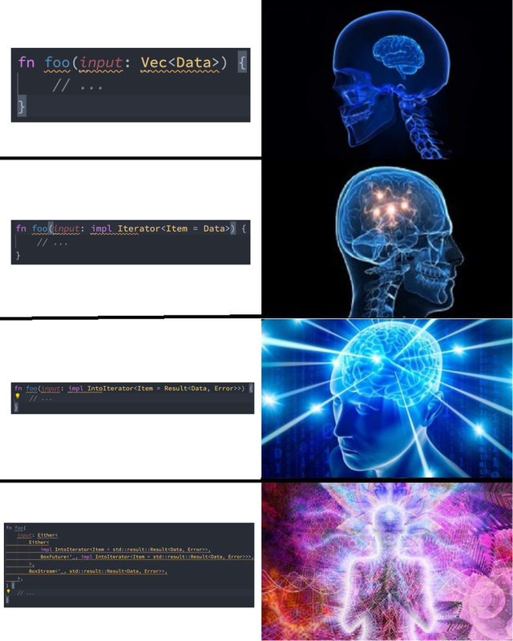

---
title:
    - Rust Presentation
author:
    - Marcel Guzik
theme:
    - Frankfurt
colortheme:
    - beaver
fontsize: 9pt

pandoc-latex-fontsize:
    - classes: [rust]
      size: scriptsize
    - classes: [plain]
      size: tiny
---

# Why Rust

-   **Both safe and performant. No tradeoffs.**

-   Zero cost abstractions!

    Really?

    [Really!](https://pkolaczk.github.io/overhead-of-optional/)

-   Both low-level and high-level

    Write mostly high-level code, go low-level when you need it!

---

-   Memory safety

    Eliminate entire classes of bugs at compile time! You **can't** corrupt memory when using safe Rust!

    

---

-   Good tooling and helpful compiler

    { width=50% }

---

Rust's focus on safety famously makes implementing classical data structures
more difficult, eg. writing a linked list is challenging for a beginner.

https://rust-unofficial.github.io/too-many-lists/

## Borrow checking

In Rust you can have:

-   Multiple immutable (or shared) references
-   A single mutable (or exclusive) reference

to an object.

---

PUT EXAMPLE HERE

### Move semantics

Move semantics in Rust are better than in C++. Why?

https://www.thecodedmessage.com/posts/cpp-move/

Short version:

In Rust, if the object is moved, it can't be accessed anymore

In C++, the moved object is still accessible, but is "empty", you need to
explicitly handle that case in the destructor, therefore move semantics are not
zero cost

## Rich type system

-   Algebraic Data Types
-   Generics
-   Traits

### Traits

{ width=50% }

---

Traits are like interfaces from Java or Go, but better.

-   https://softwareengineering.stackexchange.com/questions/247298/how-are-rust-traits-different-from-go-interfaces#247313
-   https://stackoverflow.com/questions/69477460/is-rust-trait-the-same-as-java-interface

---

In short:

-   it gives you a choice between static and dynamic dispatch (static dispatch
    means bigger code size but faster generics)

    ```rust
    // fast, bigger code size
    fn static_dispatch<T: MyTrait>(arg: T) { }

    // slow, less code size, uses Vtable
    fn dynamic_dispatch(arg: Box<dyn MyTrait>) { }
    ```

---

-   object definition / method implementation is decoupled (you implement in
    impl blocks)

    ```rust
    #[derive(Debug, Clone, Copy)]
    struct Vec3 {
        x: f32,
        y: f32,
        z: f32,
    }

    impl Add for Vec3 {
        type Output = Vec3;

        fn add(self, rhs: Self) -> Self::Output {
            Vec3 {
                x: self.x + rhs.x,
                y: self.y + rhs.y,
                z: self.z + rhs.z,
            }
        }
    }

    impl Add<f32> for Vec3 {
        type Output = Vec3;

        fn add(self, rhs: f32) -> Self::Output {
            Vec3 {
                x: self.x + rhs,
                y: self.y + rhs,
                z: self.z + rhs,
            }
        }
    }
    ```

---

-   you can conditionally implement a trait for a type

    ```rust
    impl<T> Clone for Vec<T> where T: Clone {...}
    ```

---

-   associated types, fuctions, values

    ```rust
    trait Iterator {
        type Item;
    }

    struct Iter<T>;
    impl Iterator for Iter<T> {
        type Item = &T;
    }

    struct IterMut<T>;
    impl Iterator for IterMut<T> {
        type Item = &mut T;
    }

    struct IntoIter<T>;
    impl Iterator for IntoIter<T> {
        type Item = T;
    }
    ```

---

#### Most important standard library traits:

-   Debug: Debug print formatting
-   Copy (requires Clone): Types that can be implicitly and trivially copied via
    bitwise copy
-   Clone: Types that can be explicitly cloned by calling `.clone()` on them.
-   Send: The type can be safely sent between threads
-   Sync: The type can be safely accessed via references from different threads.
    If `&T` is `Send`, then `Sync` is derived automatically

---

Comparing values:

-   PartialEq: For types that have partial equality
-   Eq: For types that have full equality
-   PartialOrd: For types with partial ordering (type can be compared if its
    less, greater, or equal)
-   Ord: For types with total ordering (can be sorted)

---

Also:

-   `Sized`: The size of this type is known at compile time. If the type has
    known size, it can be used as fields in structs or placed on the stack.
    `?Sized` (maybe sized) means size of type is not known at compile time.

    Unlike previous traits, this is assumed for all types, and only unsized
    types implement `!Sized` (not sized). Example:

    -   https://doc.rust-lang.org/stable/std/primitive.slice.html#impl-Sized
    -   https://doc.rust-lang.org/stable/std/primitive.str.html#impl-Sized

    Slices and string slices are not `Sized`, but the references to them are.

---

**[We use rich type systems to design APIs that are flexible and simple, but
most importantly,
correct.](https://fasterthanli.me/articles/aiming-for-correctness-with-types)**

## Algebraic data types

What is algebraic data type?

> In computer programming, especially functional programming and type theory, an
> algebraic data type is a kind of composite type, i.e., a type formed by
> combining other types.

We can combine types in two ways:

-   Sum types
-   Product types

In other languages, structs/classes are like a product type, but there is no
proper sum type.

---

In Rust, enums are sum types. Enums can contain values.

Example: standard library `Option`/`Result` types.

```rust
enum Option<T> {
    Some(T),
    None
}
```

```rust
let some_int: Option<i32> = Some(5);
let no_int: Option<i32> = None;
```

```rust
enum Result<T, E> {
    Ok(T),
    Err(E)
}
```

```rust
// Returns string on success. Returns error code on failure.
fn op_that_can_fail -> Result<String, i32> {
    // ...
}

let result = op_that_can_fail();

match result {
    Ok(text) => println!("success: {text}"),
    Err(err_code) => println!("error! code: {err_code}")
}
```

---

It is impossible to not error check in Rust, because you need to handle the
error to access the success value:

```rust
let text: String = std::fs::read_to_string("file.txt");
println!("{text}");
```

```plain
error[E0308]: mismatched types
 --> examples/result.rs:2:24
  |
2 |     let text: String = std::fs::read_to_string("file.txt");
  |               ------   ^^^^^^^^^^^^^^^^^^^^^^^^^^^^^^^^^^^ expected struct `String`, found enum `Result`
  |               |
  |               expected due to this
  |
  = note: expected struct `String`
               found enum `Result<String, std::io::Error>`

For more information about this error, try `rustc --explain E0308`.
error: could not compile `rust-demo` due to previous error
```

---

To unwrap the value on success, but exit the program on failure, use `.unwrap()`
or `.expect("your message")`.

```rust
let text: String = std::fs::read_to_string("file.txt").unwrap();
println!("{text}");
```

On failure (eg. when `file.txt` does not exist):

```plain
thread 'main' panicked at 'called `Result::unwrap()` on an `Err` value: Os { code: 2, kind: NotFound, message: "No such file or directory" }', examples/result.rs:2:60
note: run with `RUST_BACKTRACE=1` environment variable to display a backtrace
```

## Generics

Trait based generics

## Fixing a billion dollar mistake

What do we usually use null pointers for in other languages?

-   to allocate data on the heap
-   to signify the presence/absence of a value

These separate concerns are coupled, so it's not possible to express in the type
system:

-   An optional value that's on the heap
-   A heap-allocated value that's non-optional, always valid

---

**That's why Rust doesn't have null.**

Short version: for optional values, we use `Option<T>`, for heap allocation, we
use `Box<T>`. If we want an optinal heap-allocated value, use `Option<Box<T>>`,
[which is optimized to use only as much memory as
`Option<T>`](https://doc.rust-lang.org/std/option/#representation).

## Standard library and documentation

Rust stdlib has two stdlibs:

-   `core`, which is a subset of `std`, targets embedded, doesnt support
    allocation and shit
-   `std`, which is bigger, targets programs running on OSes that provide APIs
    for memory allocation, file operations, system calls, etc.

Use https://std.rs or https://std.rs/[search term] to search (eg.
https://std.rs/vector searches for `vector`)

For documentation of crates, use https://docs.rs

## Crates.io

Crates.io is a public package registry for Rust, so like npm for node. To
install the crate to our project, we add it to `Cargo.toml` in the
`[dependencies]` section:

```
rand = "0.8.5"
```

Or just use `cargo-edit` program:

```
$ cargo install cargo-edit

$ cargo add rand
```

## Tooling (build system, package manager, rustfmt, clippy)

# Getting started

## How install?

Use rustup.rs. It lets you install multiple versions of rust. Usually you'll use
stable but sometimes you might want to use features that are still unstable and
available only on nightly. Also clippy and rustfmt are parts of the toolchain.

## Linux

Install via your package manager or https://rustup.rs/ if it's not in your
distro's repositories. The website installer will automatically prompt you to
install the stable toolchain. If you installed rustup via package manager,
install stable toolchain: `rustup toolchain install stable`.

## Windows

Install via https://rustup.rs. To use MSVC backend, which is recommended, you'll
need to have installed either Visual Studio 2015+ C++ workload or VS C++ build
tools standalone if you don't use visual studio.

You can also use MinGW, but it won't be covered here.

## IDE setup

I personally recommend VS Code with rust-analyzer, but feel free to use
something you're comfortable with if it's supported.

List of Rust IDEs/plugis available at: https://areweideyet.com


## VS Code + rust-analyzer

What does rust-analyzer do?


-   type hinitng
-   autocomplete
-   jump to declaration/definition
-   Autoapply suggestions

After you have Rust stable toolchain installed, just install the VS Code
rust-analyzer extension. In case of difficulties, refer to the
[manual](https://rust-analyzer.github.io/manual.html#vs-code).

## Troubleshooting

The extension works if the root directory of Rust project is opened in VS Code
(the folder that contains `Cargo.toml`). If you have opened a directory with
multiple Rust projects, you'll have to manually specify paths for rust-analyzer.

# Learing Rust

## Basics

Basics of Rust

## Fearless concurrency

Doing concurrency in Rust relies on `Copy`, `Send`, and `Sync` traits.

Classic "parallelism is hard" example: spawn a bunch of threads that increment a
counter.

```rust
use std::thread;

fn main() {
    let mut counter: i32 = 0;
    let mut handles = Vec::new();

    for _ in 0..4 {
        let handle = thread::spawn(|| {
            for _ in 0..100_000 {
                counter += 1;
            }
        });
        handles.push(handle);
    }

    // join threads before exiting the main function. Without this threads could
    // outlive the main function and we'd get another error
    for handle in handles {
        handle.join().unwrap();
    }

    println!("{counter}");
}
```

---

Output:

```plain
$ cargo run --example 06_thread_counter
   Compiling rust-demo v0.1.0 (/home/marcel/Documents/dev/projects/rust-presentation/rust-demo)
error[E0499]: cannot borrow `counter` as mutable more than once at a time
  --> examples/06_thread_counter.rs:8:36
   |
8  |           let handle = thread::spawn(|| {
   |                        -             ^^ `counter` was mutably borrowed here in the previous iteration of the loop
   |  ______________________|
   | |
9  | |             for _ in 0..100_000 {
10 | |                 counter += 1;
   | |                 ------- borrows occur due to use of `counter` in closure
11 | |             }
12 | |         });
   | |__________- argument requires that `counter` is borrowed for `'static`

error[E0373]: closure may outlive the current function, but it borrows `counter`, which is owned by the current function
  --> examples/06_thread_counter.rs:8:36
   |
8  |         let handle = thread::spawn(|| {
   |                                    ^^ may outlive borrowed value `counter`
9  |             for _ in 0..100_000 {
10 |                 counter += 1;
   |                 ------- `counter` is borrowed here
   |
note: function requires argument type to outlive `'static`
  --> examples/06_thread_counter.rs:8:22
   |
8  |           let handle = thread::spawn(|| {
   |  ______________________^
9  | |             for _ in 0..100_000 {
10 | |                 counter += 1;
11 | |             }
12 | |         });
   | |__________^
help: to force the closure to take ownership of `counter` (and any other referenced variables), use the `move` keyword
   |
8  |         let handle = thread::spawn(move || {
   |                                    ++++

Some errors have detailed explanations: E0373, E0499.
For more information about an error, try `rustc --explain E0373`.
error: could not compile `rust-demo` due to 2 previous errors
```

So, Rust has two problems here:

-   our thread can outlive the counter
-   can't borrow counter more than

---

First problem: thread can outlive the counter

"But we join the thread before exiting from main, so this code should be valid!"

That's right, `counter` can't go out of scope before threads finish. Why the
error then?

---


`F: Send + 'static` means that variables borrowed by `F` have to be `Send` and
`'static`.

---

-   `Send`: Need to be able to send stuff to the thread. Pretty self
    explanatory. Is `i32: Send`?

    {width=50%}

    You bet.

---

-   `'static`: Data has to have `'static` lifetime, which is to say, it needs to
    live for the entire duration of the program

    In theory it shouldn't be necessary. There are ways to spawn the thread
    which do not require this. The `crossbeam` crate provides the scoped thread
    spawning function.

    Also, scoped threads will be added to standard library in the future:

    {width=50%}

---

For now, we will just make `counter` a static:

```rust
static mut COUNTER: i32 = 0;

fn main() {
    // ...
}
```

```plain
$ cargo run --example 06_thread_counter
   Compiling rust-demo v0.1.0 (/home/marcel/Documents/dev/projects/rust-presentation/rust-demo)
error[E0133]: use of mutable static is unsafe and requires unsafe function or block
  --> examples/06_thread_counter.rs:11:17
   |
11 |                 COUNTER += 1;
   |                 ^^^^^^^^^^^^ use of mutable static
   |
   = note: mutable statics can be mutated by multiple threads: aliasing violations or data races will cause undefined behavior

For more information about this error, try `rustc --explain E0133`.
error: could not compile `rust-demo` due to previous error
```

---

The cursed fix: add `unsafe`:

```rust
let handle = thread::spawn(|| {
fn main() {
    // ...

    for _ in 0..100_000 {
        unsafe {
            COUNTER += 1;
        }
    }

    // ...

    unsafe {
        println!("{COUNTER}");
    }
}

```

```plain
$ cargo run --example 06_thread_counter
    Finished dev [unoptimized + debuginfo] target(s) in 0.00s
     Running `target/debug/examples/06_thread_counter`
354443
```

The usual ensues...

---

Now make it good.

We will sync access to the counter with a Mutex.

```rust
use std::{sync::Mutex, thread};

static COUNTER: Mutex<i32> = Mutex::new(0);

fn main() {
    let mut handles = Vec::new();

    for _ in 0..4 {
        let handle = thread::spawn(|| {
            for _ in 0..100_000 {
                let mut guard = COUNTER.lock().unwrap();
                *guard += 1;
            }
        });
        handles.push(handle);
    }

    // join threads before exiting the main function.
    for handle in handles {
        handle.join().unwrap();
    }

    let counter = COUNTER.lock().unwrap();
    println!("{counter}");
}
```

---

Output:

```plain
$ cargo run --example 06_thread_counter
   Compiling rust-demo v0.1.0 (/home/marcel/Documents/dev/projects/rust-presentation/rust-demo)
error[E0015]: calls in statics are limited to constant functions, tuple structs and tuple variants
 --> examples/06_thread_counter.rs:3:30
  |
3 | static COUNTER: Mutex<i32> = Mutex::new(0);
  |                              ^^^^^^^^^^^^^

For more information about this error, try `rustc --explain E0015`.
error: could not compile `rust-demo` due to previous error
```

Rust disallows running functions for static variables.

---

Solution: use reference counting for shared ownership.

```rust
use std::{
    sync::{Arc, Mutex},
    thread,
};

fn main() {
    // wrap the mutex in an Atomic Reference Counter
    let counter: Arc<Mutex<i32>> = Arc::new(Mutex::new(0));
    let mut handles = Vec::new();

    for _ in 0..4 {
        // clone the reference counter. Clone is &T -> T, so now we can move
        // the refcounter inside the closure
        let c = Arc::clone(&counter);
        let handle = thread::spawn(move || {
            for _ in 0..100_000 {
                let mut guard = c.lock().unwrap();
                *guard += 1;
            }
        });
        handles.push(handle);
    }

    // join threads before exiting the main function.
    for handle in handles {
        handle.join().unwrap();
    }

    let counter = counter.lock().unwrap();
    println!("{counter}");
}
```

---

Output:

```plain
$ cargo run --example 06_thread_counter
   Compiling rust-demo v0.1.0 (/home/marcel/Documents/dev/projects/rust-presentation/rust-demo)
    Finished dev [unoptimized + debuginfo] target(s) in 0.20s
     Running `target/debug/examples/06_thread_counter`
400000
```

This is correct!

For scoped threads and comparisons to Go, see [Some mistakes Rust doesn't
catch](https://fasterthanli.me/articles/some-mistakes-rust-doesnt-catch)

## Async

## Other good sources

-   [I am a Java, C#, C or C++ developer, time to do some
    Rust](https://fasterthanli.me/articles/i-am-a-java-csharp-c-or-cplusplus-dev-time-to-do-some-rust)

    Comprehensive introduction to Rust for developers of other Object Oriented
    languages

-   [Declarative memory
    management](https://fasterthanli.me/articles/declarative-memory-management)

    How Rust memory management differs from C or C++

-   [Learn Rust in Y minutes](https://learnxinyminutes.com/docs/rust/)
-   [Rust Book](https://doc.rust-lang.org/book/)

# Other tips

-   Use clone
-   Use clippy

# Sources

-   https://fasterthanli.me
-   https://www.youtube.com/c/fasterthanlime
-   https://www.youtube.com/c/JonGjengset
-   https://pkolaczk.github.io
-   https://www.reddit.com/r/rustjerk

# Bonus

## Owned vs borrowed types


"Wow, what a mess, it's too complex! Better to use language like Go, which is
simpler."

**You can't eliminate complexity. If it's not exposed, it's hidden and may have
unexpected consequences.**

-   https://fasterthanli.me/articles/i-want-off-mr-golangs-wild-ride
-   https://viralinstruction.com/posts/defense/

also lol no generics

---

How to make sense of this?

It's a common pattern that types in Rust are divided into "owned" types and
"borrowed" types.

---

Owned types:

-   `String` - Owned, Rust native, UTF-8 encoded, explicitly sized string
-   `CString` - Owned C-compatible null-terminated string
-   `OsString` - Owned, platform-native strings (so on Unix UTF-8, on Windows
    UTF-16, etc.)
-   `PathBuf` - Wrapper around `OsString`, with logic to manage path according
    to the platform (so on Unix separator is `/`, on Windows it's `\`, etc.)
-   `Vec<u8>` - Owned vector of unsigned bytes

---

Borrowed types:

-   `&str`
-   `&' static str`
-   `CStr`
-   `OsStr`
-   `Path`
-   `&[u8]`
-   `&[u8; N]`
-   `&u8`

---

"But you told me borrowing in Rust is done with `&`, so why do some don't have
that? Also, if to borrow we just add `&`, then why is borrowed string not just
`&String`? What's the difference?"

### Strings

To show the difference we'll look into just `&str` and `String`.

First, like any respectable programmer, let's turn for help to Stack Overflow:

https://stackoverflow.com/questions/24158114/what-are-the-differences-between-rusts-string-and-str


---

`String`:

-   Mutable
-   Manages memory
-   Heap-allocated

`&str`:

-   Immutable, "view" of the string
-   A reference to memory managed by somebody else - Is a "slice" so it can
    point to any portion of the string
-   Can be on heap, on stack, static, etc.

---

How they look on the inside?

In _Rust pseudo-code_:

String:

```rust
struct String {
    data: *mut u8,      // pointer to heap allocated data - 8 bytes
    length: usize,      // length of the string - 8 bytes
    capacity: usize,    // capacity of the string to grow, size of the current allocation - 8 bytes
}

dbg!(std::size_of::<String>()); // 24
```

Str:

```rust
struct &str {
    data: *const u8 // pointer to string - 8 bytes
    length: usize   // length of the string - 8 bytes
}

dbg!(std::mem::size_of::<&str>()); // 16
```

---

So internally they're quite different, `&str` is smaller, and they do different
things, that's why they are different types. The same goes for the rest of
types.

The following are analogous to `String` and `&str`:

-   `CString` and `CStr`
-   `OsString` and `OsStr`
-   `PathBuf` and `Path`

More about strings: https://fasterthanli.me/articles/working-with-strings-in-rust

---

### Vecs and slices

What about `Vec<u8>`, `[u8; N]`, `&[u8; N]`, `&[u8]`?

`Vec<u8>` and `[u8; N]` are arrays of `u8`; former is growable and
heap-allocated, latter is constant size and may be on the stack.

`&[u8; N]` - a reference to array of type `u8` of size `N`

`&[u8]` - a slice of type `u8` (so, a "view" into an array of type `u8`, either
`Vec<u8>` or `[u8; N]`)

---

"Ok, what does that mean for me, which should i use?"

In methods, use least restricive, most "generic" type:

Instead of:

```rust
fn read_bytes(bytes: &Vec<u8>)
fn read_string(text: &String)
```

do:

```rust
fn read_bytes(bytes: &[u8])
fn read_string(text: &str)
```

---

But dont overthink it for now:


