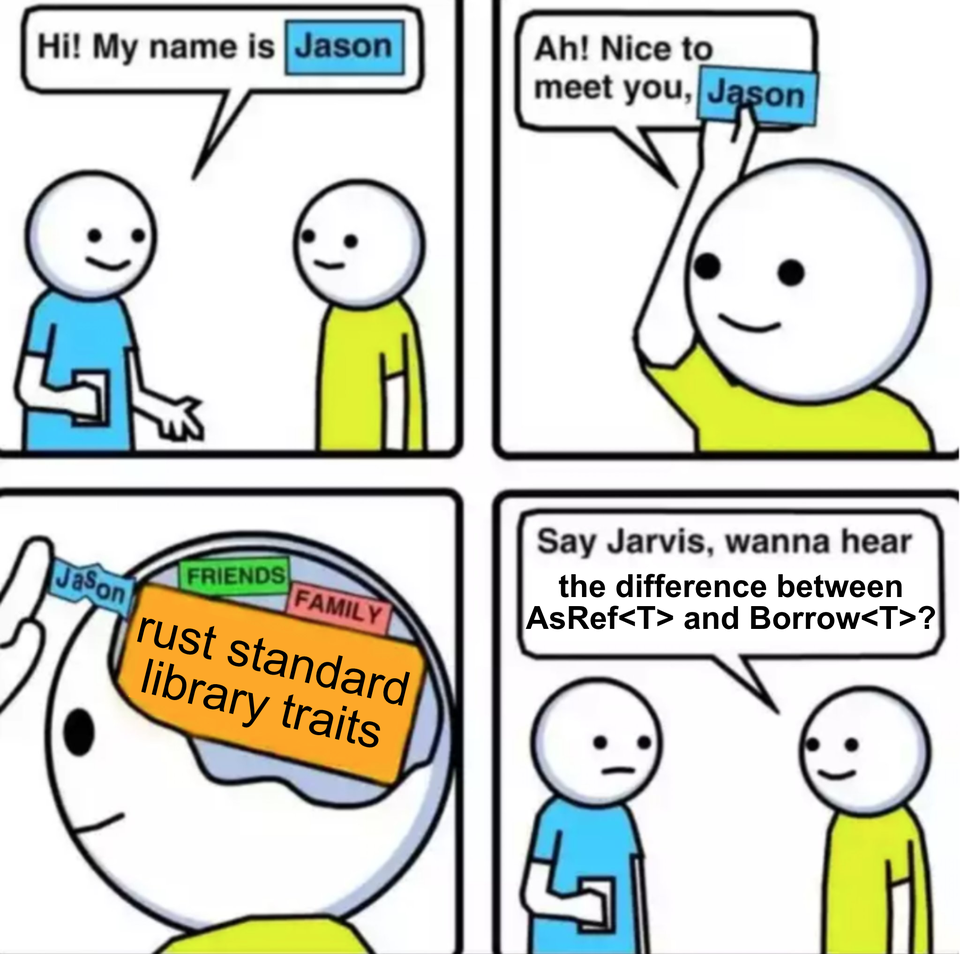
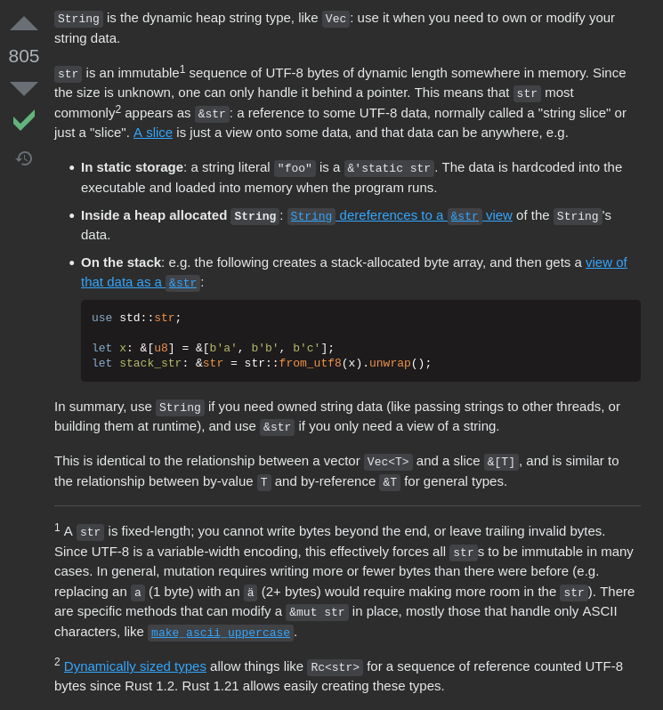
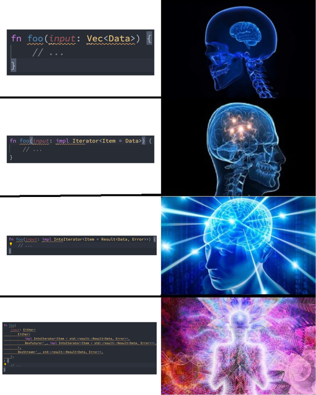

# Rust presentation

## Why Rust

### Zero cost abstractions!

Really?

[Really!](https://pkolaczk.github.io/overhead-of-optional/)

### Borrow checking

#### Move semantics

Move semantics in Rust are better than in C++. Why?

https://www.thecodedmessage.com/posts/cpp-move/

Short version:

In Rust, if the object is moved, it can't be accessed anymore

In C++, the moved object is still accessible, but is "empty", you need to
explicitly handle that case in the destructor, therefore move semantics are not
zero cost

### Rich type system

-   Algebraic Data Types
-   Generics
-   Traits



**[We use rich type systems to design APIs that are flexible and simple, but most
importantly, correct.](https://fasterthanli.me/articles/aiming-for-correctness-with-types)**

#### I'm gonna say the M-word

`Option`/`Result` types.

#### Fixing a billion dollar mistake

What do we usually use null pointers for in other languages?

-   to allocate data on the stack
-   to signify the presence/absence of a value

These separate concerns are coupled, so it's not possible to express in the type
system:

-   An optional value that's on the stack
-   A heap-allocated value that's non-optional, always valid

**That's why Rust doesn't have null.**

Short version: for optional values, we use `Option<T>`, for heap allocation, we
use `Box<T>`. If we want an optinal heap-allocated value, use `Option<Box<T>>`,
[which is optimized to use only as much memory as
`Option<T>`](https://doc.rust-lang.org/std/option/#representation).

#### Owned vs borrowed types


"Wow, what a mess, it's too complex! Better to use language like Go, which is
simpler."

**You can't eliminate complexity. If it's not exposed, it's hidden and may have
unexpected consequences.**

-   https://fasterthanli.me/articles/i-want-off-mr-golangs-wild-ride

also lol no generics

How to make sense of this?

It's a common pattern that types in Rust are divided into "owned" types and
"borrowed" types.

Owned types:

-   `String` - Owned, Rust native, UTF-8 encoded, explicitly sized string
-   `CString` - Owned C-compatible null-terminated string
-   `OsString` - Owned, platform-native strings (so on Unix UTF-8, on Windows
    UTF-16, etc.)
-   `PathBuf` - Wrapper around `OsString`, with logic to manage path according
    to the platform (so on Unix separator is `/`, on Windows it's `\`, etc.)
-   `Vec<u8>` - Owned vector of unsigned bytes

Borrowed types:

-   `&str`
-   `&' static str`
-   `CStr`
-   `OsStr`
-   `Path`
-   `&[u8]`
-   `&[u8; N]`
-   `&u8`

"But you told me borrowing in Rust is done with `&`, so why do some don't have
that? Also, if to borrow we just add `&`, then why is borrowed string not just
`&String`? What's the difference?"

##### Strings

To show the difference we'll look into just `&str` and `String`.

First, like any respectable programmer, let's turn for help to Stack Overflow:

https://stackoverflow.com/questions/24158114/what-are-the-differences-between-rusts-string-and-str



`String`:

-   Mutable
-   Manages memory
-   Heap-allocated

`&str`:

-   Immutable, "view" of the string
-   A reference to memory managed by somebody else - Is a "slice" so it can
    point to any portion of the string
-   Can be on heap, on stack, static, etc.

How they look on the inside?

In _Rust pseudo-code_:

String:

```rust
struct String {
    data: *mut u8,      // pointer to heap allocated data - 8 bytes
    length: usize,      // length of the string - 8 bytes
    capacity: usize,    // capacity of the string to grow, size of the current allocation - 8 bytes
}

dbg!(std::size_of::<String>()); // 24
```

Str:

```rust
struct &str {
    data: *const u8 // pointer to string - 8 bytes
    length: usize   // length of the string - 8 bytes
}

dbg!(std::mem::size_of::<&str>()); // 16
```

So internally they're quite different, `&str` is smaller, and they do different
things, that's why they are different types. The same goes for the rest of
types.

The following are analogous to `String` and `&str`:

-   `CString` and `CStr`
-   `OsString` and `OsStr`
-   `PathBuf` and `Path`

More about strings: https://fasterthanli.me/articles/working-with-strings-in-rust

##### Vecs and slices

What about `Vec<u8>`, `[u8; N]`, `&[u8; N]`, `&[u8]`?

`Vec<u8>` and `[u8; N]` are arrays of `u8`; former is growable and
heap-allocated, latter is constant size and may be on the stack.

`&[u8; N]` - a reference to array of type `u8` of size `N`

`&[u8]` - a slice of type `u8` (so, a "view" into an array of type `u8`, either
`Vec<u8>` or `[u8; N]`)

"Ok, what does that mean for me, which should i use?"

In methods, use least restricive, most "generic" type:

Instead of:

```rust
fn read_bytes(bytes: &Vec<u8>)
fn read_string(text: &String)
```

do:

```rust
fn read_bytes(elements: &[u8])
fn read_string(elements: &str)
```

But dont overthink it for now:



### Big stdlib

Rust stdlib has two stdlibs:

-   `core`, which is a subset of `std`, targets embedded, doesnt support
    allocation and shit
-   `std`, which is bigger, targets programs running on OSes that provide APIs
    for memory allocation, file operations, system calls, etc.

### Tooling (build system, package manager, rustfmt, clippy)

## Learning Rust

-   [Learn Rust in Y minutes](https://learnxinyminutes.com/docs/rust/)
-   [I am a Java, C#, C or C++ developer, time to do some
    Rust](https://fasterthanli.me/articles/i-am-a-java-csharp-c-or-cplusplus-dev-time-to-do-some-rust)
-   [Rust Book](https://doc.rust-lang.org/book/)

## Tips

-   Use clone

## Sources

-   https://fasterthanli.me
-   https://www.youtube.com/c/fasterthanlime
-   https://www.youtube.com/c/JonGjengset
-   https://pkolaczk.github.io
-   https://www.reddit.com/r/rustjerk
